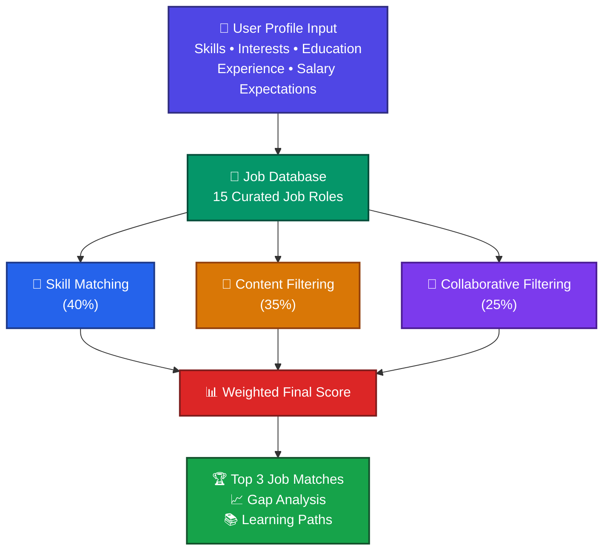

<div align="">

# 🎯 CareerMatch
### *AI-Powered Smart Job Recommendation System*

<br/>


<br/>

> **Discover your perfect career path using three complementary ML algorithms —**
> **Skill Matching · Content-Based Filtering · Collaborative Filtering**

<br/>

---

</div>

## 📌 Table of Contents
- [Overview](#-overview)
- [Live Demo](#-live-demo)
- [Features](#-features)
- [How It Works](#-how-it-works)
- [Tech Stack](#-tech-stack)
- [Project Structure](#-project-structure)
- [Getting Started](#-getting-started)
- [Algorithm Details](#-algorithm-details)
- [Future Roadmap](#-future-roadmap)
- [Author](#-author)

---

## 🌟 Overview

**CareerMatch** is a fully client-side, privacy-first career recommendation platform. It analyzes your **skills**, **interests**, **education**, and **experience** to match you with the most suitable job roles — using three complementary machine learning algorithms that run entirely in your browser.

No backend. No cloud. No data collection. Just intelligent recommendations, instantly.

---

## 🚀 Live Demo

> 🔗 [Coming Soon — Deploy on Vercel](#)

```bash
# Run it locally in 3 steps:
git clone https://github.com/YOUR_USERNAME/career-recommendation-ui.git
cd career-recommendation-ui
npm install && npm run dev
```

---

## ✨ Features

| Feature | Description |
|---|---|
| 🎯 **Skill-Based Matching** | Cosine similarity between your skills and job requirements |
| 📄 **Content-Based Filtering** | Semantic matching of interests and education with job categories |
| 👥 **Collaborative Filtering** | Recommendations based on similar professional profiles |
| 📊 **Weighted Score Engine** | Final score = 40% Skill + 35% Content + 25% Collaborative |
| 🔍 **Skills Gap Analysis** | Shows exactly which skills you're missing per job |
| 🛤️ **Learning Path Suggestions** | Recommends resources to bridge your skill gaps |
| 🔒 **100% Private** | All data stored in browser `localStorage` — never leaves your device |
| ⚡ **Zero Latency** | No API calls, no server — runs entirely client-side |

---

## 🧠 How It Works

# Job Recommendation System Workflow


   ---

## 🛠️ Tech Stack

| Layer | Technology |
|---|---|
| **Framework** | Next.js 16 + React 19 |
| **Language** | TypeScript 5.7 |
| **Styling** | Tailwind CSS v4 + shadcn/ui + Radix UI |
| **Forms & Validation** | React Hook Form + Zod |
| **Charts** | Recharts |
| **State Management** | React Context API + Custom Hooks |
| **Storage** | Browser `localStorage` (no external DB) |
| **Package Manager** | pnpm |

---

## 📁 Project Structure

```text
career-recommendation-ui/
│
├── 📂 app/
│   │
│   ├── 📄 layout.tsx
│   │   └── Root layout, metadata & global styling
│   │
│   ├── 📄 page.tsx
│   │   └── Landing page with hero section and features
│   │
│   ├── 📂 dashboard/
│   │   └── 📄 page.tsx
│   │       └── User profile form and preferences
│   │
│   └── 📂 results/
│       └── 📄 page.tsx
│           └── Displays top job recommendations
│
├── 📂 components/
│   │
│   ├── 📄 ProfileForm.tsx
│   │   └── Collects skills, interests, education, experience
│   │
│   ├── 📄 JobRecommendationCard.tsx
│   │   └── Recommendation card with score breakdown
│   │
│   └── 📂 ui/
│       └── Reusable shadcn/ui components
│
├── 📂 lib/
│   │
│   ├── 📂 algorithms/
│   │   ├── 📄 skillMatching.ts
│   │   │   └── Cosine similarity based skill matching
│   │   │
│   │   ├── 📄 contentBased.ts
│   │   │   └── Interest & profile based recommendations
│   │   │
│   │   ├── 📄 collaborativeFiltering.ts
│   │   │   └── Similar user profile matching
│   │   │
│   │   └── 📄 combineScores.ts
│   │       └── Weighted score aggregation engine
│   │
│   ├── 📂 data/
│   │   └── 📄 jobDatabase.ts
│   │       └── 15 curated job role datasets
│   │
│   └── 📂 utils/
│       └── 📄 storage.ts
│           └── LocalStorage utility functions
│
├── 📂 hooks/
│   └── 📄 useUserProfile.ts
│       └── Custom hook for profile state management
│
├── 📂 public/
│   └── Static assets, icons and images
│
├── 📄 README.md
├── 📄 package.json
├── 📄 tailwind.config.ts
├── 📄 next.config.js
└── 📄 tsconfig.json
```
---

## ⚙️ Getting Started

### Prerequisites
- Node.js `v18+`
- npm / pnpm

### Installation

```bash
# 1. Clone the repository
git clone https://github.com/Rohan607p/career-recommendation-ui.git

# 2. Move into the project
cd career-recommendation-ui

# 3. Install dependencies
npm install

# 4. Start the development server
npm run dev
```

Open [http://localhost:3000](http://localhost:3000) in your browser.

### Build for Production

```bash
npm run build
npm run start
```

---

## 🔬 Algorithm Details

### 1. 🎯 Skill-Based Matching *(Weight: 40%)*
Converts user skills and job requirements into vectors, then computes **cosine similarity** to find the angle between them.
### 2. 📄 Content-Based Filtering *(Weight: 35%)*
Uses **semantic string similarity** (Levenshtein distance) to match user interests and education level with job descriptions and categories.
### 3. 👥 Collaborative Filtering *(Weight: 25%)*
Creates **profile embeddings** based on skills, experience, and interests — then scores jobs based on industry demand and profile similarity patterns.
### 🏆 Final Score

---

## 🔮 Future Roadmap

- [ ] 📄 Resume upload with automatic skill extraction
- [ ] 🗄️ Expand job database to 500+ curated positions
- [ ] 🛤️ Full skill development roadmaps with course links
- [ ] 📊 PDF export of personalized career report
- [ ] 🔁 Feedback loop to improve recommendations over time
- [ ] 🌐 Deploy on Vercel with shareable profile links

---

## 👨‍💻 Author

<div align="center">

**Rohan Patil**

B.E. Computer Engineering (AI & ML)
Smt. Indira Gandhi College of Engineering, Ghansoli

[](https://linkedin.com/in/rohan-patil-tech)
[](https://github.com/Rohan607p)

</div>

---

<div align="center">

⭐ **If you found this project helpful, please give it a star!** ⭐

*Made with ❤️ using Next.js + TypeScript*

</div>
